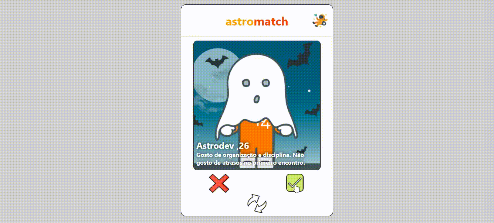

<h1 align="center">
    Astromatch
</h1>



---

# Índice

- [Descrição](#-descrição-do-projeto)
- [Como acessar o projeto](#-como-acessar-o-projeto)
- [Tecnologias utilizadas](#-tecnologias-utilizadas)
- [Instalação](#-como-baixar-o-projeto)

---

## 🖋 Descrição do projeto

O projeto **Astromatch** foi desenvolvido durante o **Bootcamp da Labenu**, com o intuito de colocarmos em prática o conteúdo estudado durante o curso, a saber: Hooks (useState e/ou useEffect). Trata-se de um clone do Tinder, com uma tela de perfils com a opção de "dar match" ou rejeitar, uma tela de Matches constituída de uma lista de usuários que "deram match" com o usuário que estiver usando a aplicação, também tem a possibilidade do usuário resetar os matches a qualquer momento.

---

## 🌎 Como acessar o projeto

- [Link do surge](https://astromatch-astroale.surge.sh/)

## 🚀 Tecnologias utilizadas

o projeto foi desenvolvido usando as seguintes tecnologias:

- [React.js](https://pt-br.reactjs.org/docs/getting-started.html)
- [Styled-Components](https://styled-components.com/docs)
- [Hooks](https://pt-br.reactjs.org/docs/hooks-intro.html)

---

## 💾 Como baixar o projeto

- Primeiro instale o [Git](https://git-scm.com/), [Node.jS](https://nodejs.org/pt-br/download/) + [npm](https://www.npmjs.com/get-npm)
```bash
# Clonar o repositório
git clone https://github.com/Ale557333/Astromatch.git

# Entrar no diretório
cd astromatch

# Instalar as dependências
npm install

# Rodar o projeto
npm run start
```

Desenvolvido com 💙 por Alexandre Oliveira 🤓
